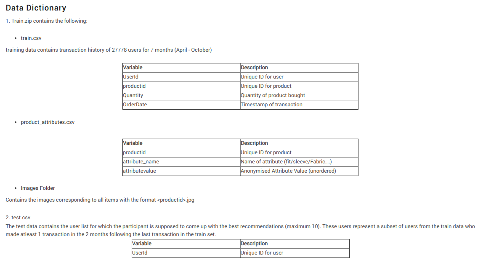

# Capillary Machine Learning Hackathon

[competition link](https://datahack.analyticsvidhya.com/contest/capillary-machine-learning-hackathon/)

__Mean average precison @ 10 (MAP@10) : 0.0303297169__

[__Private Leader Board Rank__](https://datahack.analyticsvidhya.com/contest/capillary-machine-learning-hackathon/pvt_lb) : __27__

[Analysis and data Preparation Notebook](https://github.com/NishantBhavsar/Product-recommendation-hackathon/blob/master/code/analysis_%26_data_prep.ipynb)

[Final model Notebook](https://github.com/NishantBhavsar/Product-recommendation-hackathon/blob/master/code/model.ipynb)

### Libraries used:
- pandas 0.22.0
- numpy 1.14.6
- matplotlib 3.0.2
- seaborn 0.7.1
- [implicit](https://github.com/benfred/implicit) 0.3.8
- keras 2.2.4
- opencv-python 3.4.5.20 
- Pillow 4.0.0

## Solution

- Here in this competition we are only evaluating model based on existing customers.
- We have more than 25000 users and 3000 products.
- We have to recommend (predict) top 10 products which a user is going to buy in last two months.
- Images of all the product and their attributes are given.

### Features
- Created features for all product based on their attribute values. Total 243 features sparse features are created.
- From Keras used DenseNet121 ImageNet pretrained model to create features from product images. Total 256 features.
- So, now product has total 499 features.

### Approach / Models
- Used 2 methods,
1. Collaborative filtering
 - Based on user-user similarity matrix and cosine similarity predicted score for all user-product pair
2. Content based filtering
 - All the product related attributte features and Image feature are used.
 - First user profile matrix has to be created, so that we can compare that to all the products and find best similar product for user.
 - Weighted average of all the product features are calculated to make profile vector for a user, whcih is based on how many times perticular product is bought by the user.
 - Now based on cosine similarity between user profile vector and all product vector, find best 10 similar products.

- Content based filtering gave higher score than user-user collaborative filtering.
- __This indicated that user are more likly to buy products similar to what they have already bought__.
- Tried Hybrid approach (Combine collaborative and content based filtering), but it didn't worked, so I have used content based filtering model as a final model.